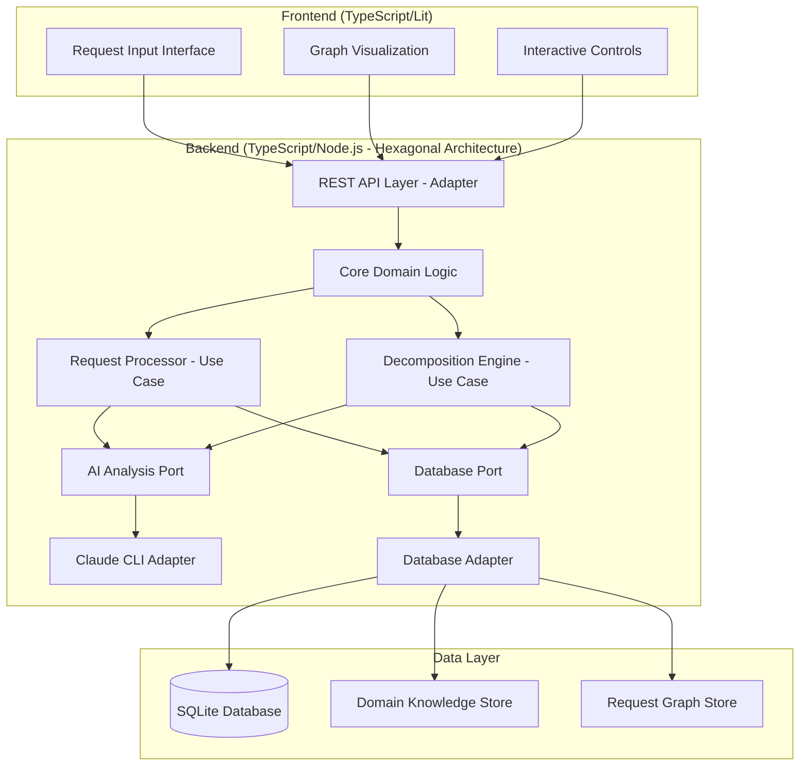

# Design Document

## Overview

The Request Decomposition System is a web application that transforms complex user requests into hierarchical graphs of actionable sub-requests. The system uses Claude Code CLI as its AI backend to analyze requests, extract domain knowledge, and perform recursive decomposition until atomic (non-decomposable) requests are identified.

The architecture follows a client-server pattern with a TypeScript/Lit frontend for user interaction and graph visualization, a TypeScript/Node.js backend using hexagonal architecture for request processing and AI integration, and a SQLite database for storing domain knowledge and request histories. The hexagonal architecture ensures clean separation between core business logic and external dependencies like Claude CLI.

## Architecture



## Components and Interfaces

### Frontend Components (Lit Web Components)

**RequestInputForm**
- Lit component handling user request submission
- Validates input length and format using TypeScript
- Displays submission status and errors
- Interface: `onSubmit(request: string) => Promise<void>`

**GraphVisualization**
- Lit component integrating D3.js for all data visualization needs
- Uses D3 for hierarchical graph rendering, zoom, pan, and expand/collapse operations
- D3 handles node positioning, transitions, and interactive behaviors
- Shows node types (root, intermediate, atomic) with TypeScript type safety
- Interface: `renderGraph(graphData: RequestGraph) => void`

**NodeDetailsPanel**
- Lit component displaying detailed information for selected nodes
- Shows decomposition reasoning and metadata
- Allows navigation between related nodes
- Interface: `showDetails(node: RequestNode) => void`

### Backend Components (Hexagonal Architecture)

**Core Domain Layer**

**RequestProcessor (Use Case)**
- TypeScript class orchestrating the decomposition workflow
- Uses AI Analysis Port for external AI communication
- Handles error states and retries with proper typing
- Interface: `processRequest(request: string) => Promise<RequestGraph>`

**DecompositionEngine (Use Case)**
- TypeScript implementation of recursive decomposition logic
- Determines when requests are atomic using type-safe logic
- Uses AI Analysis Port and Database Port for external dependencies
- Interface: `decompose(request: string, depth: number) => Promise<RequestNode[]>`

**DomainKnowledgeManager (Domain Service)**
- TypeScript service for domain knowledge business logic
- Manages concept relationships and definitions with strong typing
- Uses Database Port for persistence operations
- Interface: `updateKnowledge(terms: Term[], relationships: Relationship[]) => Promise<void>`

**Ports (Interfaces)**

**AIAnalysisPort**
- Interface defining AI analysis capabilities
- Abstracts away specific AI implementation details
- Interface: `analyzeRequest(request: string, context: DomainContext) => Promise<AnalysisResult>`

**DatabasePort**
- Interface defining data persistence operations
- Abstracts database implementation details
- Interface: `saveGraph(graph: RequestGraph) => Promise<void>`, `getDomainKnowledge() => Promise<DomainContext>`

**Adapters (External Integrations)**

**ClaudeCliAdapter**
- TypeScript implementation of AIAnalysisPort using Claude CLI
- Handles prompt engineering for decomposition tasks
- Manages context and conversation state
- Can be replaced with other AI providers without changing core logic

**SQLiteDatabaseAdapter**
- TypeScript implementation of DatabasePort using SQLite
- Handles actual database operations and data mapping
- Manages SQLite-specific queries and transactions
- Can be swapped for different database technologies through the port interface

## Data Models

### RequestNode
```typescript
interface RequestNode {
  id: string;
  text: string;
  type: 'root' | 'intermediate' | 'atomic';
  parentId?: string;
  children: string[];
  reasoning: string;
  domainTerms: string[];
  createdAt: Date;
  metadata: {
    complexity: number;
    confidence: number;
    decompositionAttempts: number;
  };
}
```

### RequestGraph
```typescript
interface RequestGraph {
  id: string;
  rootNodeId: string;
  nodes: Map<string, RequestNode>;
  originalRequest: string;
  status: 'processing' | 'complete' | 'error';
  createdAt: Date;
  completedAt?: Date;
}
```

### DomainTerm
```typescript
interface DomainTerm {
  id: string;
  term: string;
  definition: string;
  domain: string;
  context: string[];
  usageCount: number;
  lastUsed: Date;
}
```

### ConceptRelationship
```typescript
interface ConceptRelationship {
  id: string;
  fromTerm: string;
  toTerm: string;
  relationshipType: 'requires' | 'depends_on' | 'enables' | 'conflicts_with';
  strength: number;
  examples: string[];
}
```

## Error Handling

### Request Processing Errors
- **Invalid Input**: Return structured error with suggestions for improvement
- **Claude CLI Failures**: Implement retry logic with exponential backoff
- **Decomposition Timeout**: Set maximum processing time and graceful degradation
- **Database Errors**: Provide fallback responses and log for investigation

### Frontend Error States
- **Network Failures**: Show retry options and offline indicators
- **Malformed Responses**: Display user-friendly error messages
- **Graph Rendering Issues**: Provide alternative text-based view
- **Session Timeouts**: Implement automatic session recovery

### Error Recovery Strategies
- Partial decomposition results when full processing fails
- Cached responses for previously processed similar requests
- Manual intervention points for complex edge cases
- Comprehensive logging for debugging and improvement

## Testing Strategy

### Functional Test Categories

**End-to-End User Workflows**
- Request submission through complete decomposition
- Graph interaction and navigation
- Error handling and recovery scenarios
- Domain knowledge accumulation over multiple requests

**Browser Automation Tests**
- Cross-browser compatibility (Chrome, Firefox, Safari)
- Responsive design validation
- Accessibility compliance testing
- Performance under various load conditions

**Integration Testing**
- Claude CLI communication and error handling
- Database operations and data consistency
- Real-time graph updates and synchronization
- Domain knowledge persistence and retrieval

**Test Data Management**
- Predefined request sets for consistent testing
- Domain knowledge seed data for reproducible results
- Graph complexity scenarios (shallow, deep, wide)
- Edge cases and boundary conditions

### Test Infrastructure
- Selenium WebDriver for browser automation
- Docker containers for consistent test environments
- CI/CD pipeline integration for automated testing
- Test result reporting and failure analysis tools